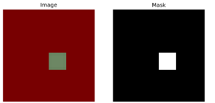
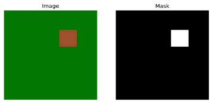
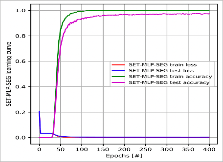
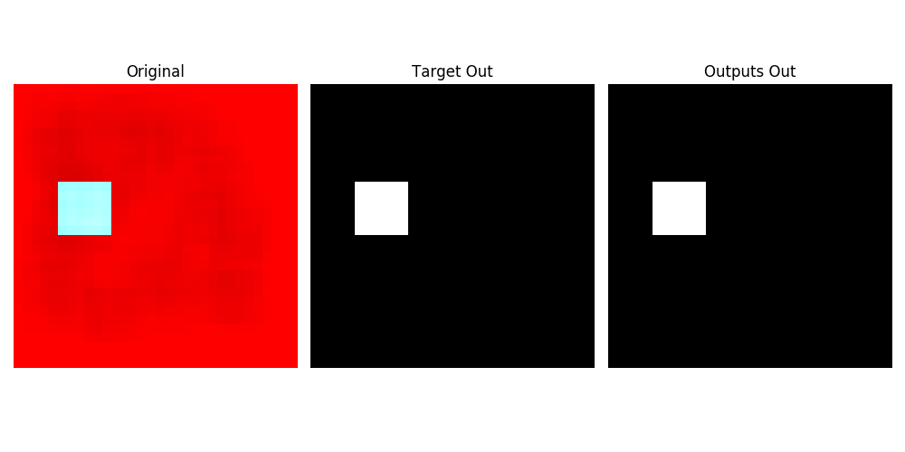
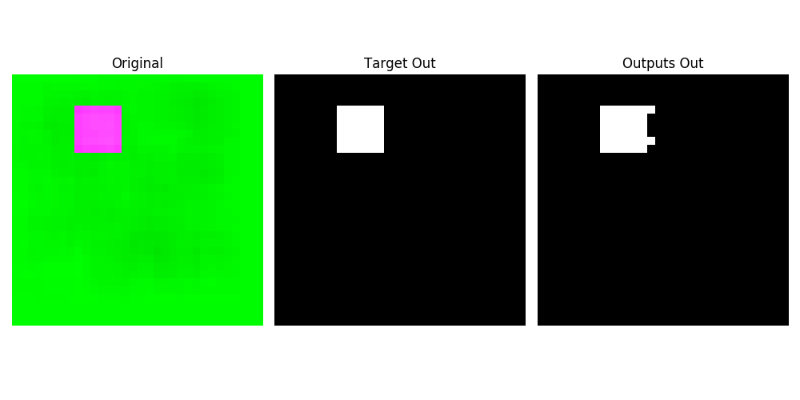

# IJCAI 2023 -- toturial
### Sparse Training for Supervised, Unsupervised, Continual, and Deep Reinforcement Learning with Deep Neural Networks

-------------------------------

#### Assignment 
**Elena Mocanu** 1, **Decebal Mocanu**  2 , **Boqian Wu** 1, **Qiao Xiao** 3

1 Faculty of Electrical Engineering, Mathematics and Computer Science, University of Twente, Enschede, 7522NB, the Netherlands  
2 Department of Computer Science, University of Luxembourg, Luxembourg  
3 Department of Mathematics and Computer Science, Eindhoven University of Technology, 5600 MB Eindhoven, the Netherlands 

##### Truly Sparse Training for Image Segmentation
 

SET has demonstrated its efficacy as a training approach in reducing the computational resources required for deploying deep neural networks. 
In order to fully explore the potential of dynamic sparse training, we have extended its application to the domain of image segmentation. For the sake of simplicity, we have generated synthetic data, including the images and their corresponding masks, to serve as the foundation for our experiments.

- **Task description**

The provided images are synthetic and have dimensions of 3x32x32. These images consist of variously colored backgrounds and squares. Accompanying each image is a corresponding mask with dimensions 1x32x32. In the mask, background areas are denoted by 0, while the square is represented by 1. The primary goal of this task is 
to achieve precise segmentation of the square object from its background.




- **Running script**

If you're interested in training your own sparse image segmentor with dynamic sparse training on the given dataset, 
go to this repository's main folder in your terminal, and run:

```sh
python set_mlp_seg.py --dropout-rate 0.3 --epsilon 20 --dataset seg_shape32
```

- **How to run your own segementation dataset**

If you're interested in training your own sparse image segmentor using dynamic sparse 
training on a dataset of your choice, you can start by examining the 'load_shape_data' class in the 'load_data.py' file located within the 'utils' folde

```python
def load_shape_data(n_samples, n_class, path2imgs, path2masks, valid_size, im_size=32, one_hot=False):

    # read shape data
    imgsmap = np.memmap(path2imgs, dtype=np.uint8, mode='r+', shape=(n_samples, im_size, im_size, 3))
    masksmap = np.memmap(path2masks, dtype=np.uint8, mode='r+', shape=(n_samples, im_size, im_size))
    imgarr = np.array(imgsmap)
    maskarr = np.array(masksmap)
    x_train = imgarr[:-valid_size]
    y_train_ori = maskarr[:-valid_size]
....
```

After that, make sure to make adjustments to the 'path2imgs' and 'path2masks' 
with your specific data path in 'set_mlp_seg.py'.


- **The learning curve for the given data**




- **The visualization of segmentation**



